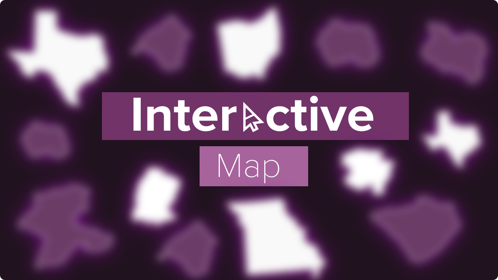

# InteractiveMap


A Library to use SVG Based Maps interactively in SwiftUI.

- Works **only with** .svg based maps
- Allows you to modify **all** the provinces in the map with the attributes that SwiftUI's `Shape` provides
- Drag, drop and animate the provinces, as well as the map itself.

Note! SVG Parsing is not yet in its final form, so some SVGs may not be parsed correctly. But as far as I can see almost every map is drawn correctly. You can see the maps I tried in the [Maps](./Maps) section.

Maps are taken from [FSInteractiveMap](https://github.com/ArthurGuibert/FSInteractiveMap) Repository

<h3 style ="text-align: center">Installation</h3> 
<p>Requires <b>iOS 13+</b> 

InteractiveMap currently can only be installed through the Swift Package Manager.</p>

<table>
<tr>
<td>
<strong>
Swift Package Manager
</strong>
<br>
Add the Package URL:
</td>
</tr>
<tr>
<td>
<br>
    
```
https://github.com/GrandSir/InteractiveMap
```
    
</td>
</table>

# Examples & ShowCase
[3D Scaling Effect](./Examples/3DEffect.swift)


[Creepy Map](./Examples/creepyMap.swift)


[Mihmandar Province Choosing Screen](./Examples/Mihmandar.swift)


<h2 style="text-align: center; padding: 10px">Usage</h2>

# SwiftUI
To draw your svg map in SwiftUI, use `InteractiveMap` with a closure taking `PathData` as the parameter.

`InteractiveMap` uses `InteractiveShape`s to draw all the paths defined in SVG. But it needs to know which `Path` will be drawn, that is, `InteractiveMap { pathData in }` works just like `ForEach { index in }` and returns an iterable closure returning `PathData` as parameter, which contains all the information about `Path`s defined inside svg.

```swift
import SwiftUI
import InteractiveMap

struct ContentView: View {
    var body: some View {
        InteractiveMap(svgName: "tr") { pathData in // or just use $0
            InteractiveShape(pathData)
                .initWithAttributes()
        }
    }
}
```
InteractiveMap resizes itself to the assigned frame, and takes all available space by default.


# Customization

Instead of using default attributes, you can define your own attributes as well. 

```swift
InteractiveMap(svgName: "tr") {
    InteractiveShape($0)
        .initWithAttributes(.init(strokeWidth: 2, strokeColor: .red, background: Color(white: 0.2)))
}
```


## Advanced Customization

Even though `.initWithAttributes` saves time for simple customization, it is neither highly customizable nor editable.

Since `InteractiveShape` is a `Shape`, you can use any methods with `InteractiveShape` that you can use with `Shape`.
```swift
InteractiveMap(svgName: "tr") {
    InteractiveShape($0)
        .stroke(Color.cyan)
        .shadow(color: .cyan, radius: 3, x: 0, y: 0)
        .background(InteractiveShape($0).fill(Color(white: 0.15)))
}
```


### Handling Clicks
`PathData` is a `Struct` that contains all the information about all the paths, in our map example, they are districts and provinces.
It has 4 variables inside it. `id`, `path` and `name`, and `svgScaleAmount`

`id` is the Unique Identifier that's being parsed directly from SVG

Most of the Map SVG's (NOT ALL!) has the `id` attribute in all in their `<path>` element like this:

`<path ... id="<id>", name="<name>">`

`MapParser`, defined in `MapParser.swift` parses that element and stores them in `PathData` struct.

If there is not any `id` attribute in path, MapParser automatically creates an UUID String.

But if you're going to store that id in somewhere, be aware that UUID String is automaticaly regenerated every time InteractiveMap is being drawed.

```swift
import SwiftUI
import InteractiveMap

struct ContentView: View {
    @State private var clickedPath = PathData.EmptyPath
    var body: some View {
        VStack {
            Text(clickedPath.name.isEmpty ? "" : "\(clickedPath.name) is clicked!" )
                .font(.largeTitle)
                .padding(.bottom, 15)

            InteractiveMap(svgName: "tr") { pathData in // is a PathData
                InteractiveShape(pathData)
                    .stroke(clickedPath == pathData ? .cyan : .red, lineWidth: 1)
                    .shadow(color: clickedPath == pathData ? .cyan : .red,  radius: 3)
                    .shadow(color: clickedPath == pathData ? .cyan : .clear , radius: 3) // to increase the glow amount
                    .background(InteractiveShape(pathData).fill(Color(white: 0.15))) // filling the shapes
                    .shadow(color: clickedPath == pathData ? .black : .clear , radius: 5, y: 1) // for depth

                    .onTapGesture {
                        clickedPath = pathData
                    }
                    .zIndex(clickedPath == pathData ? 2 : 1) // this is REQUIRED because InteractiveShapes overlap, resulting in an ugly appearance
                    .animation(.easeInOut(duration: 0.3), value: clickedPath)
            }
        }
    }
}
```
`clickedPath == pathData` basically compares the id's of the PathDatas.


# UIKit

soon

# SpriteKit

soon
